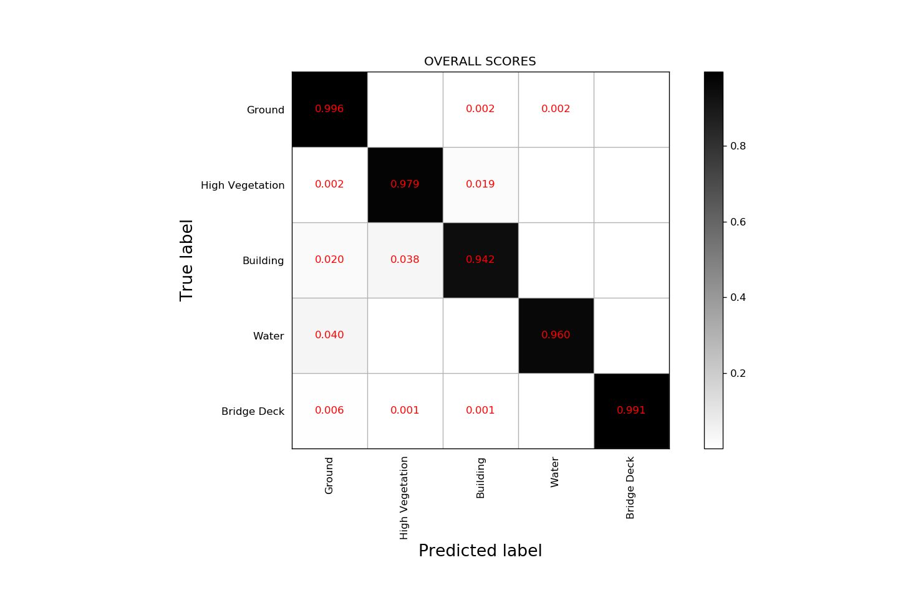
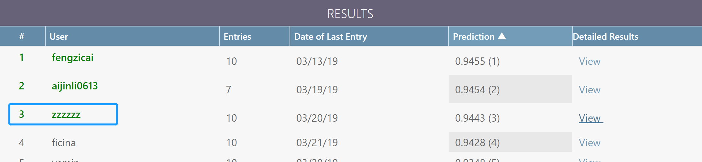

# IGRSS Data Fusion Contest 2019 point cloud segmentation track rank 3 method

## Data description

Track 4 is the 3D Point Cloud Classification track. The goal is to classify (semantically segment) point clouds on a per point basis. The classes are:

| Class Index   | Class Description |
| :-----------: | ----------------- |
| 2             | Ground            |
| 5             | High Vegetation   |
| 6             | Building          |
| 9             | Water             |
| 17            | Bridge Deck       |

## Baseline

For the baseline algorithm, a [PointNet++](https://github.com/charlesq34/pointnet2) model was updated with modifications to support splitting/recombining large scenes.

## [PointSIFT](https://github.com/MVIG-SJTU/pointSIFT)
PointSIFT is a semantic segmentation framework for 3D point clouds. It is based on a simple module which extract featrues from neighbor points in eight directions.

## Result

    Confusion matrix with overall accuracy: 98.33%
    T P(2) P(5) P(6) P(9) P(17) 
    ---------------------------------------------------
    2 5103290| 65| 20517| 4408| 3066|
    5 1810| 1343702| 28977| 2| 4|
    6 47554| 16342| 1322237| 0| 1036|
    9 3379| 0| 0| 191191| 20|
    17 5130| 0| 692| 0| 83878|

    mIoU: 0.944256680661

    IoU:
    Class 2 ( Ground ): 0.9833
    Class 5 ( High Vegetation ): 0.9655
    Class 6 ( Building ): 0.9184
    Class 9 ( Water ): 0.9605
    Class 17 ( Elevated Road ): 0.8936

## Original [repository](https://github.com/pubgeo/dfc2019)

[*@pubgeo*](https://github.com/pubgeo)
## Usage
`Data Augumentation`

    $ cd utils
    $ please refer to utils/README.md
`Date Preparation`

    $ cd dfc
    $ python create_train_dataset.py --help

`Train & Eval`
    
    $ chmod 777 run_5_fold.sh
    $ ./run_5_fold.sh

`Visualization`

    We have provided a handy point cloud visualization tool under utils. Run sh compile_render_balls_so.sh to compile it and then you can try the demo with python show3d_balls.py.

## Co-Author

[*@ShoupingShan*](https://github.com/ShoupingShan)

[*@yinianqingzhi*](https://github.com/yinianqingzhi)

## Contact us
[**shp395210@outlook.com**](shp395210@outlook.com)